# 조선 야행 — 산속 미로 탈출 (컴퓨터그래픽스 기말 프로젝트)

> Three.js 기반 1인칭 공포 미로 게임. 핵심 그래픽스 기술로 **DDGI(Dynamic Diffuse Global Illumination)** 를 직접 구현한다.
>
> **플레이 링크:** https://jonghunpark09093.github.io/joseon-maze/ · **소스:** https://github.com/jonghunpark09093/joseon-maze

> 본 리포트의 모든 그림은 **이 게임에서 직접 캡쳐한 이미지**(`captures/`)다. 외부/예시 이미지는 사용하지 않았다.

---

## 1. 게임 개요 (기획)

- **컨셉:** 칠흑 같은 조선 산속, 등불 하나에 의지해 미로를 빠져나가는 공포 탈출 게임.
- **조작:** `WASD` 이동 · 마우스 시점 · `Shift` 달리기(기력 소모).
- **목표:** 출구의 **나무 대문**에 도달하면 탈출(Escape). 어둠 속 두 포식자(귀신·호랑이)에게 붙잡히면 실패(Died). 달리기는 기력 게이지를 소모하므로 무한 도주는 불가.
- **왜 미로 + 등불인가 (GI 관점):** 어두운 실내 + 강한 색의 벽(단청 적색) + 이동하는 광원(등불) 조합은 **간접광·색 번짐(color bleeding)** 이 가장 잘 드러나는 무대다. DDGI의 효과를 시각적으로 증명하기에 최적.

**미로 전체 구조 (top-down, 디버그용 평면 조명):** 25×25 점유 격자가 벽(인스턴싱)으로 월드에 배치된 모습.

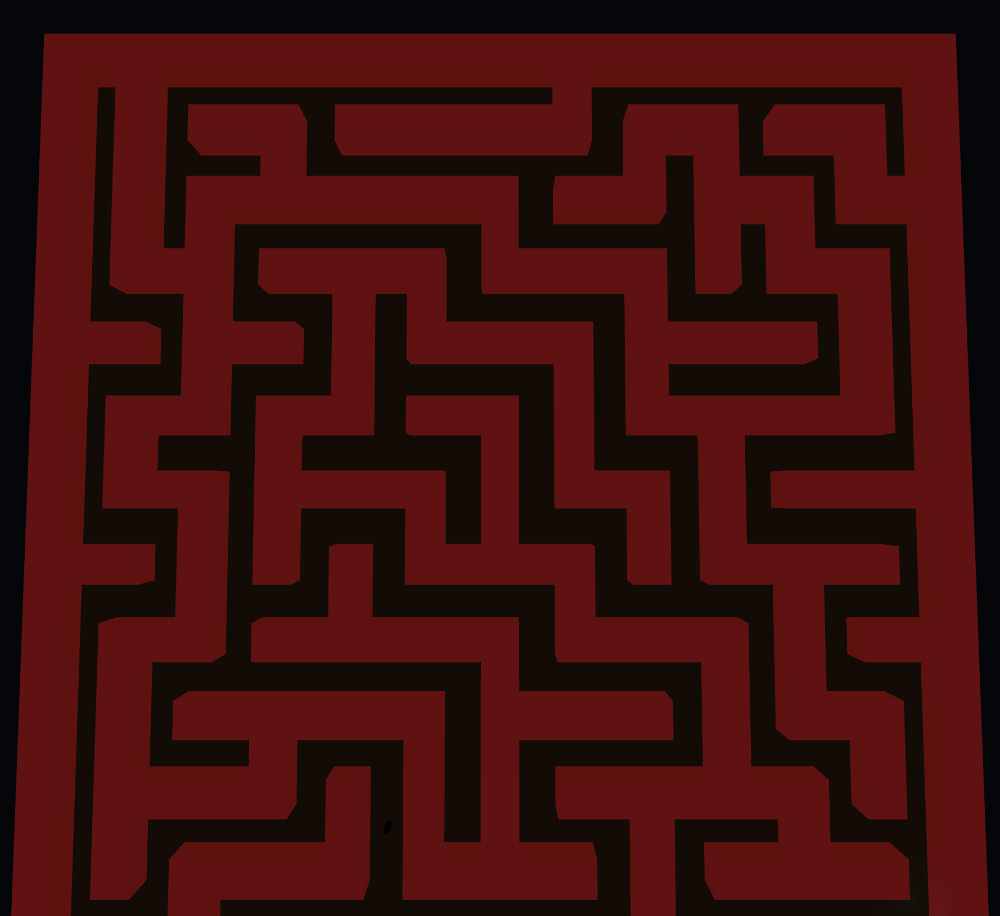

**목표 — 출구 나무 대문 & 밤하늘:** 미로의 가장 깊은 셀(시작점에서 BFS 최장거리)에 조선풍 나무 대문(기둥·인방, 절차 생성)을 세우고, **그 대문 뒤로 미로 경계까지 통로(천장·벽 제거)를 트어 밤하늘 HDRI(equirectangular, §6)가 문 너머로 보이게** 했다. 어둠 속 미로를 빠져나오면 별이 가득한 밤하늘이 드러난다 — *조선 야행* 테마의 시각적 보상.

| 출구 나무 대문 | 문 너머 밤하늘 |
|---|---|
| 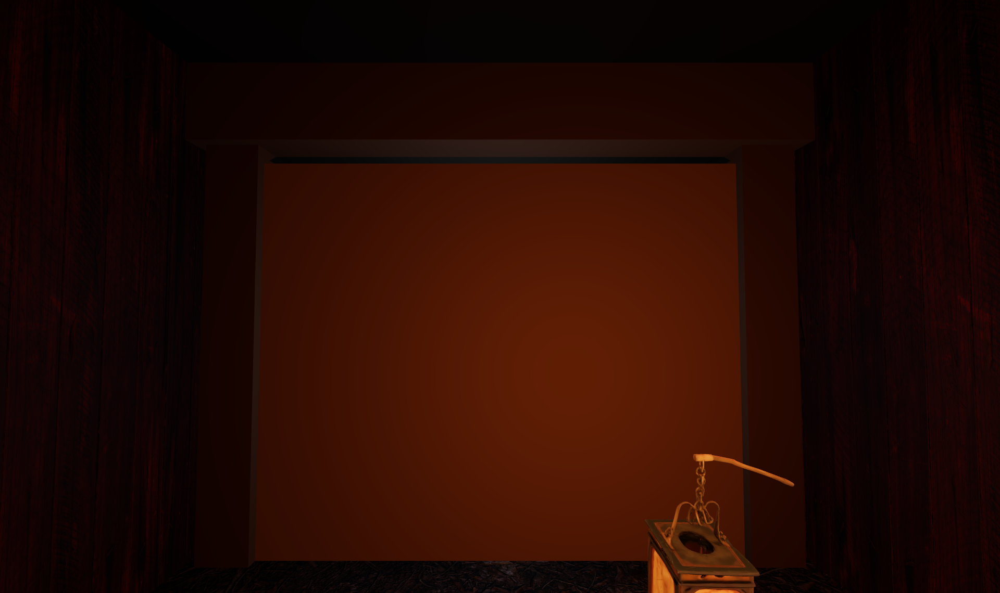 | 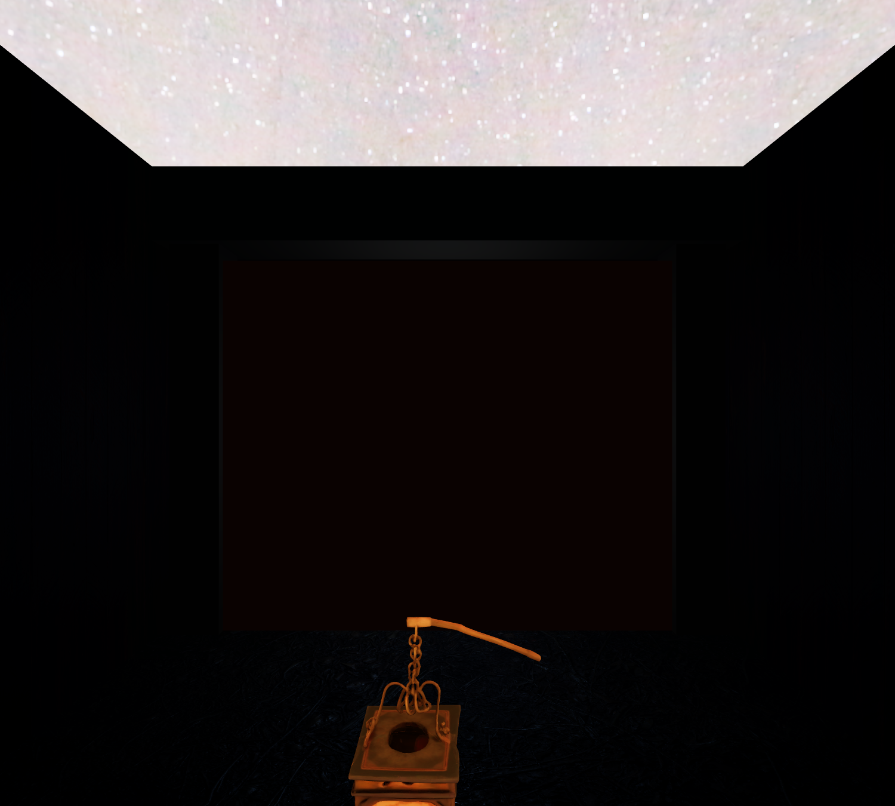 |

---

## 2. 강의 내용 ↔ 구현 매핑

> 강의에서 다룬 그래픽스 파이프라인(좌표 변환 → 셰이딩/라이팅 → 텍스처 → 글로벌 일루미네이션 → 애니메이션) 순서로 매핑한다.

### 2.1 좌표 변환 파이프라인 (Model → World → View → Projection)
- 미로 벽은 로컬 박스 지오메트리(Model space)를 `InstancedMesh`의 인스턴스 행렬로 World space에 배치 → 강의의 **SRT/Model 변환** 대응.
- 1인칭 카메라가 View 변환을, `PerspectiveCamera`가 Projection 변환을 담당.
- 위 §1 평면도가 인스턴싱된 월드 배치 결과다.

### 2.2 셰이딩 & 라이팅 (Phong / Blinn-Phong, 광원 타입)
- `MeshStandardMaterial`(물리 기반) + 점광원(등불, `PointLight`)으로 **확산광/반사광/거리 감쇠** 표현 → 폼 반사 모델·Attenuation 대응.
- 광원 타입: 등불=Point Light, 달빛=Directional Light, 배경 채움광=Ambient Light → Light Source Types 대응.
- 아래 텍스처 적용 복도에서 등불을 중심으로 한 거리 감쇠(가까운 벽·바닥은 밝고 멀수록 어두워짐)를 볼 수 있다.

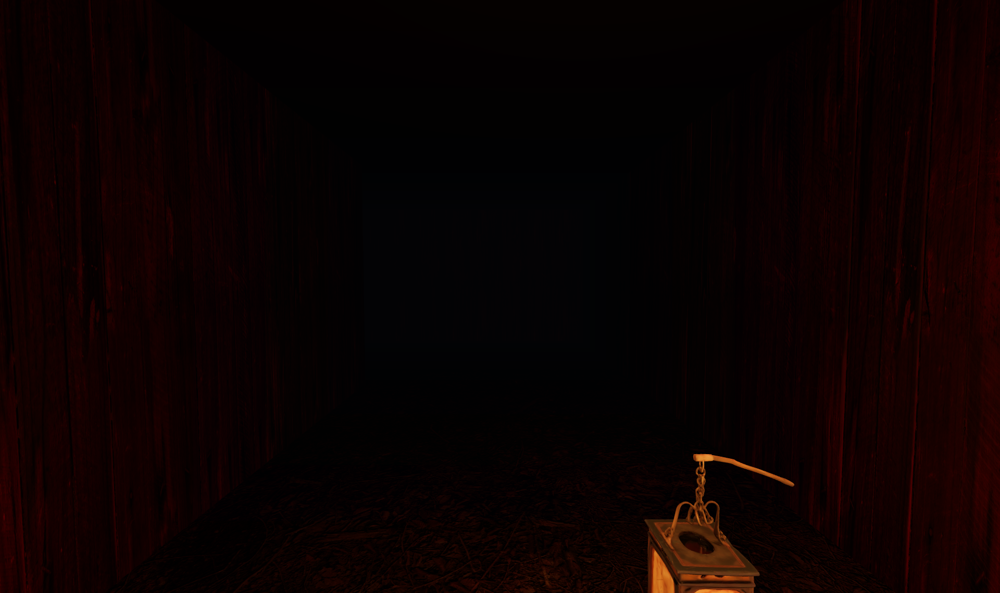

### 2.3 텍스처 & UV 매핑
- **벽·바닥 PBR 텍스처:** 벽(풍화 목재 판벽)과 바닥(산속 흙·낙엽)에 **diffuse + normal(법선) + roughness + AO** 4개 맵을 `MeshStandardMaterial`에 매핑하고, `RepeatWrapping`으로 셀 단위 UV 타일링했다(Poly Haven CC0, §6). 강의의 **텍스처 매핑 / 법선 매핑 / UV** 단계에 직접 대응한다.
- **단청 톤 유지:** 벽 albedo에 따뜻한 적갈색 틴트를 곱해 목재를 단청 핏빛으로 보정했다. DDGI **색 번짐(color bleeding)** 의 바운스 색은 별도 albedo 상수로 구동되므로, 텍스처를 입혀도 §2.4의 적색 간접광 데모는 그대로 유지된다.
- **등불 UV + emissive 트릭:** 플레이어가 든 등불(`public/models/lantern.glb`)은 UV 텍스처를 가진 glTF 에셋이다. 같은 diffuse 맵을 `emissiveMap`으로 재사용해 텍셀 밝기로 발광을 변조 → **밝은 종이 갓만 빛나고 어두운 나무 틀은 발광하지 않는다**(단일 메시에서 부분 발광). §3.3 참조.

| 인게임 — PBR 텍스처 적용 복도 | 등불 에셋 (UV + emissive) |
|---|---|
|  | 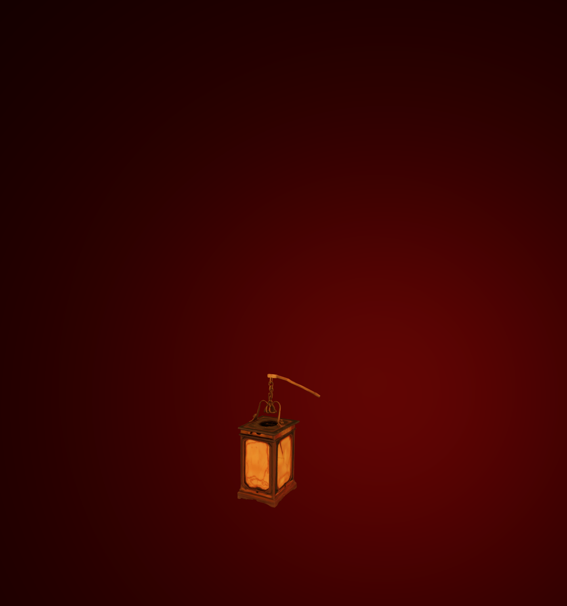 |

### 2.4 글로벌 일루미네이션 — DDGI (핵심)
- 프로브 격자 + 옥타헤드럴 irradiance/depth atlas + **SDF 레이마칭** + **Chebyshev 가시성** 으로 DDGI를 직접 구현. 상세는 §4.

**GI OFF vs ON (간접광·색 번짐):** 등불의 따뜻한 빛이 단청 적색 벽에 반사되어 직접광이 닿지 않는 영역까지 붉게 물든다. (아래 비교 컷은 텍스처 노이즈를 배제하고 **간접광 효과만 분리**해 보이기 위해 단색 셰이딩 벽에서 캡쳐했다.)

| GI OFF | GI ON |
|---|---|
| 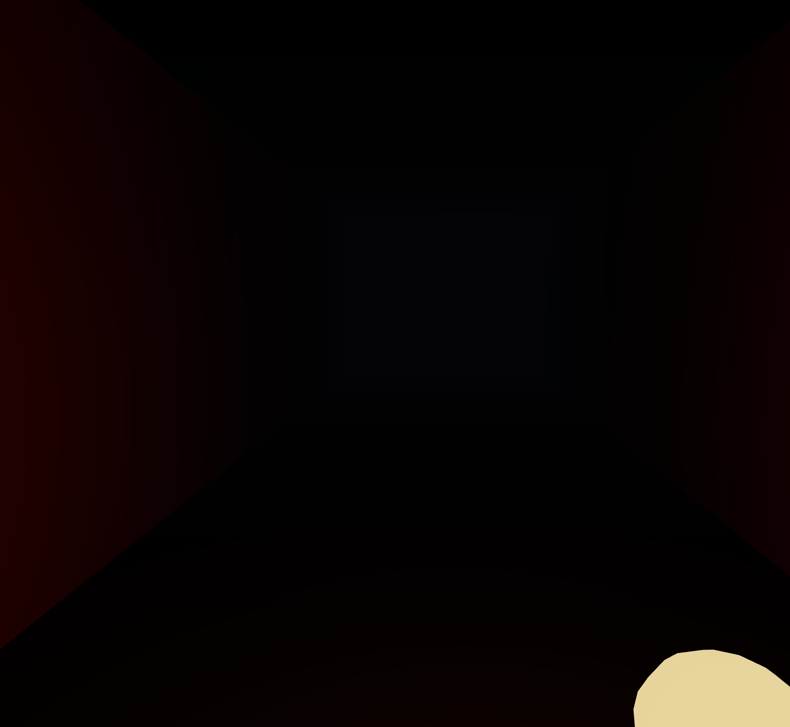 |  |

**Dynamic — 등불 이동 시 실시간 갱신:** 플레이어(=등불)가 새 구역으로 이동하면 그 구역의 프로브가 즉시 재수렴한다. (이동 직후 / 수렴 후)

| 이동 직후 | 수렴 후 |
|---|---|
|  |  |

### 2.5 애니메이션 — 두 포식자(스켈레탈) & 등불 흔들림
- **스켈레탈 애니메이션:** 두 포식자 모두 리그된 glTF 모델을 `AnimationMixer`로 재생한다. **귀신**(소복 처녀귀신)은 잠복 시 `Unsteady_Walk`, 추격 시 `Run` 클립을 크로스페이드하고, **호랑이**는 `Run` 클립으로 달린다 → 강의의 **키프레임/스켈레탈 애니메이션** 대응.
- **AI 이동:** 둘 다 점유 격자 위 **BFS 경로 탐색** 으로 플레이어를 추적한다. 귀신은 항상 느리게 스토킹하다 근접 시 빠르게 추격(거리로 따돌림 가능), 호랑이는 복도 시야/근접 시 돌진. 등불은 사인 합으로 흔들림(flicker).
- 어둠 속에서 등불 빛이 쓸고 지나갈 때만 포식자가 드러난다(광원/이미시브 대비 = 공포 연출).

| 추격자 — 처녀귀신 | 두 번째 포식자 — 호랑이 |
|---|---|
| 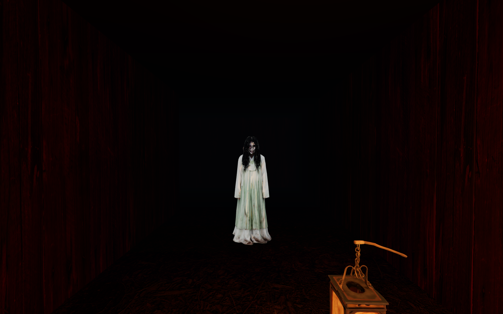 | 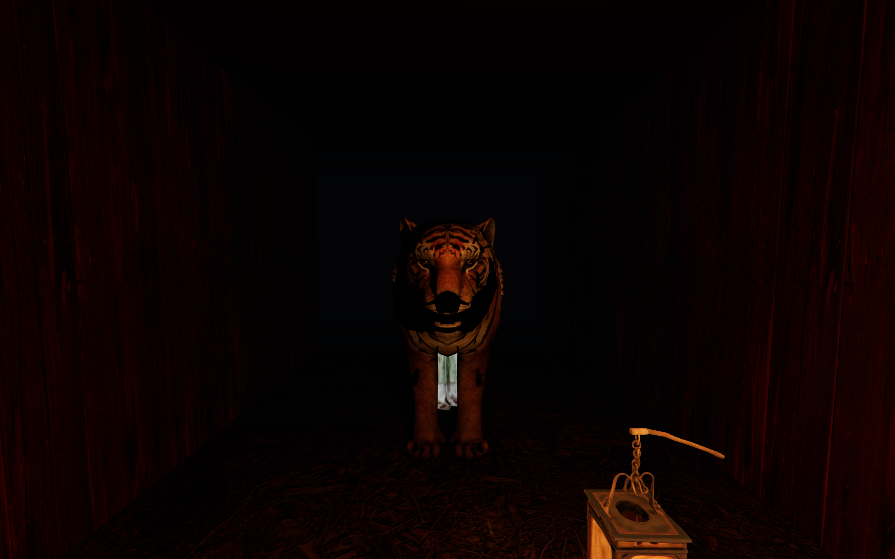 |

---

## 3. 개발 상세

### 3.1 미로 생성 — 재귀 백트래커 + 점유 격자
- `cellsX × cellsZ` 셀 격자에 재귀 백트래커로 완전 미로를 생성하고, `(2W+1)×(2H+1)` **점유 격자(1=벽, 0=바닥)** 로 확장.
- 이 점유 격자는 **충돌·렌더링·DDGI의 SDF가 공유하는 단일 진실 공급원(single source of truth)**.


### 3.2 충돌 처리
- 플레이어를 원(disc)으로 보고 점유 격자의 벽 셀 AABB와 교차 검사. X·Z축 분리 이동으로 벽을 따라 미끄러짐.

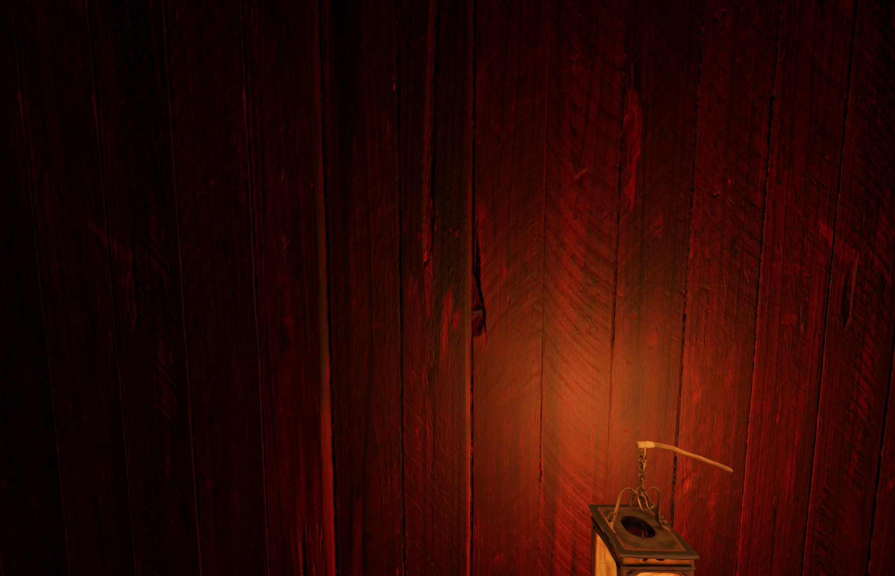

### 3.3 등불 (이동 광원)
- 카메라를 따라다니는 따뜻한 점광원 + flicker(사인 합). 그림자 맵 포함.
- **뷰모델 오버레이 패스:** 든 등불(텍스처 에셋)은 별도 `viewScene` + 고정 원점 카메라에서 렌더한 뒤, 월드를 그린 다음 **깊이 버퍼만 비우고 그 위에 합성**한다(FPS 뷰모델 기법). 덕분에 벽에 바짝 붙어도 등불 모델이 벽을 관통하지 않는다.
- **광원 위치 보정:** 점광원은 카메라 행렬로 산출한 등불 위치에 두되, 벽에 가까우면 그 점이 벽 뒤로 가 화면이 암흑이 되므로 **시점→등불 방향으로 마칭하며 벽이 없는 첫 지점**으로 클램프한다.


### 3.4 두 포식자 AI (게임플레이)
- **귀신**(`src/pursuer.js`): 미로 중간 거리에 스폰. 평소 플레이어를 향해 느리게 **스토킹**(BFS, 걷기보다 느림)하다가 감지 반경 안에 들면 **빠른 추격**으로 전환. 멀리 떨어져 일정 시간 버티면 다시 스토킹으로 — *거리를 벌리는 것*이 탈출법.
- **호랑이**(`src/tiger.js`): 미로를 **배회**하다 복도 **시야(line-of-sight)** 또는 근접 시 빠르게 **돌진**, 시야를 잃으면 배회 복귀 — *모퉁이로 시야를 끊는 것*이 탈출법. 두 포식자의 회피법이 서로 다르다.
- **최종 추격(homing):** BFS는 플레이어 *셀 중심*까지만 안내하므로, 경로 소진 후엔 플레이어 실제 위치로 직진해 끝까지 따라붙는다.
- `catchRadius` 진입 시 **붉은 점프스케어 → 게임오버(Died)**. 근접 시 HUD 경고.

| 추격자 — 처녀귀신 | 두 번째 포식자 — 호랑이 |
|---|---|
|  |  |

### 3.5 기력(스태미나) 시스템
- `Shift` 질주가 기력 게이지를 소모하고, 비질주 시 천천히 회복. 0이 되면 **'지쳤다'** 상태로 일정 회복 전까지 걷기로 고정 → 포식자를 무한히 따돌릴 수 없어 긴장 유지(좌하단 HUD 기력 게이지).


---

## 4. DDGI 구현 상세

> "irradiance probe"를 진짜 **DDGI** 로 만드는 핵심은 **프로브별 가시성(visibility)** 이다. 본 구현은 SDF 레이마칭 gather + Chebyshev 깊이 모멘트로 이를 직접 구현한다. (`src/ddgi.js`)

### 4.1 프로브 그리드 배치
- 점유 격자 해상도에 맞춘 3D 프로브 격자(`gw × 3 × gh`). 각 프로브는 옥타헤드럴 타일로 irradiance와 depth-moment를 저장.

**프로브가 배치되는 점유 격자 공간:** 아래 평면도의 25×25 격자 좌표에 프로브 격자가 정렬된다.


### 4.2 SDF 레이마칭으로 프로브 광선 추적 (하드웨어 RT 없이 WebGL2)
- 미로는 축 정렬 격자이므로 점유 격자를 **SDF** 로 보고 프래그먼트 셰이더에서 DDA 레이마칭. 하드웨어 레이트레이싱 없이 프로브마다 다방향 광선을 추적해 등불 직접광 + 벽 반사 albedo를 적분.

**레이마칭으로 적분된 간접광 결과(인게임):** 직접광이 닿지 않는 영역까지 벽 반사로 붉게 물든다.


### 4.3 옥타헤드럴 irradiance/depth atlas (MRT)
- 한 번의 gather 패스에서 **MRT 2채널** 로 (1) irradiance와 (2) 거리·거리² 모멘트를 동시에 출력. 코사인 가중 누적 + 시간적(temporal) 블렌딩으로 노이즈 억제.

**아틀라스에 시간적 블렌딩으로 수렴된 간접광:** 등불 이동 후 프로브가 재수렴한 모습.


### 4.4 Chebyshev 가시성 테스트 (빛 샘 방지) — irradiance probe와 DDGI를 가르는 지점
- 셰이딩 점이 프로브의 평균 거리보다 멀면 "벽 뒤"로 보고 variance shadow(체비셰프 부등식)로 기여를 차감 → 벽 너머 누수 차단.
- **설계 노트(정직한 관찰):** 본 구현은 gather 단계에서 이미 SDF 가시성을 계산하므로 누수가 본질적으로 적다. 따라서 Chebyshev는 주로 **트라이리니어 보간 단계의 잔여 누수**를 잡는 보정 역할이다.

| Chebyshev OFF | Chebyshev ON |
|---|---|
| 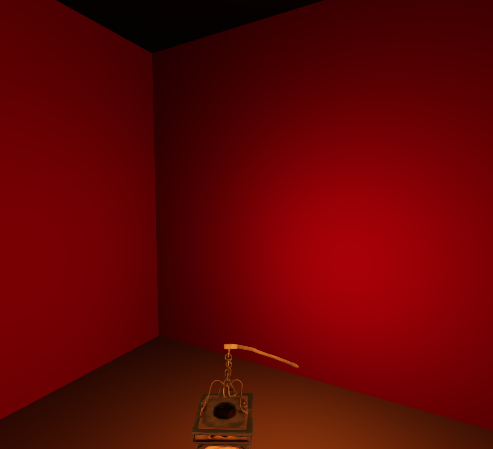 | 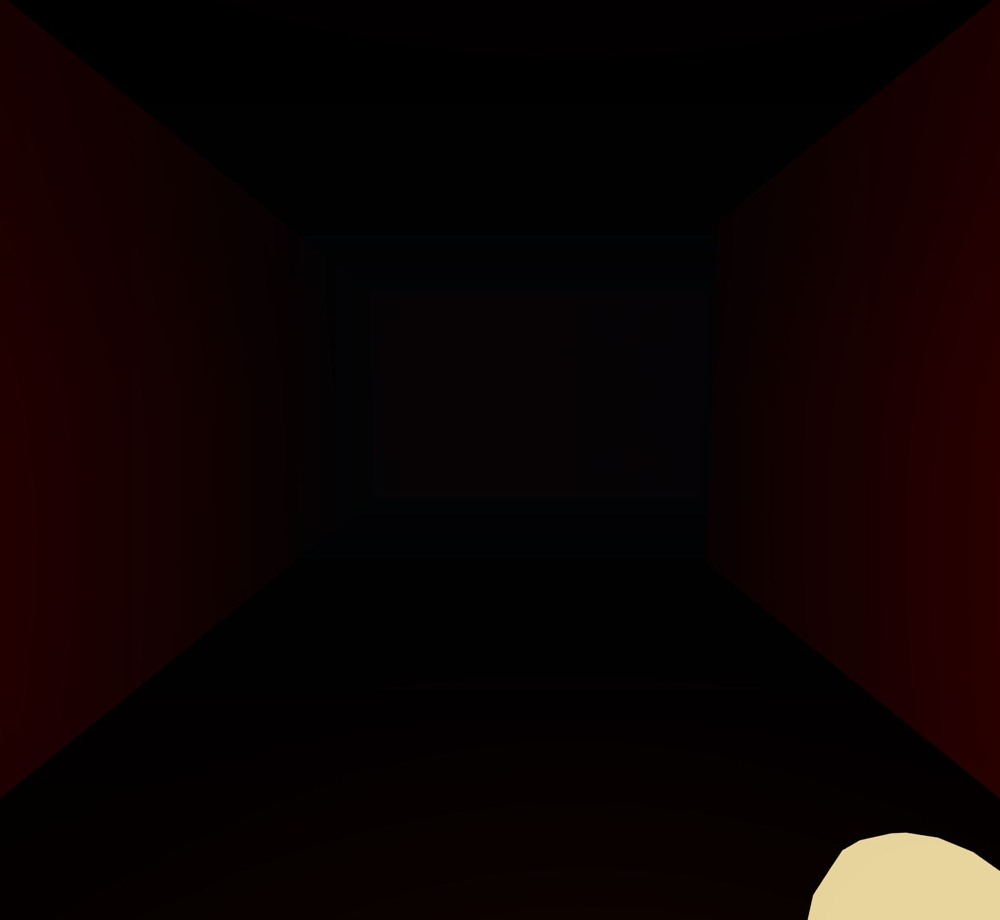 |

- **자기-차폐(self-occlusion) 보정:** Chebyshev를 그대로 켜면 벽이 자기 자신을 가려 벽면에 어두운 얼룩이 생긴다. 가시성 비교 전에 셰이딩 점을 노멀 방향으로 밀어내는 **노멀 바이어스(`uNormalBias`)** 로 해결했다.

### 4.5 동적 갱신
- 등불 위치를 매 프레임 gather 셰이더에 전달하고, 핑퐁 타깃으로 프로브를 지속 갱신 → 광원이 움직이면 간접광도 실시간으로 따라온다. (§2.4 Dynamic 그림)

### 4.6 한계 및 관찰 (정직한 분석)

> 프로브 기반 GI는 본질적으로 **프로브 격자 해상도와 보간**에 묶인 근사다. 본 구현에서도 다음 두 아티팩트가 관찰됐고, 이는 DDGI 계열의 알려진 trade-off다.

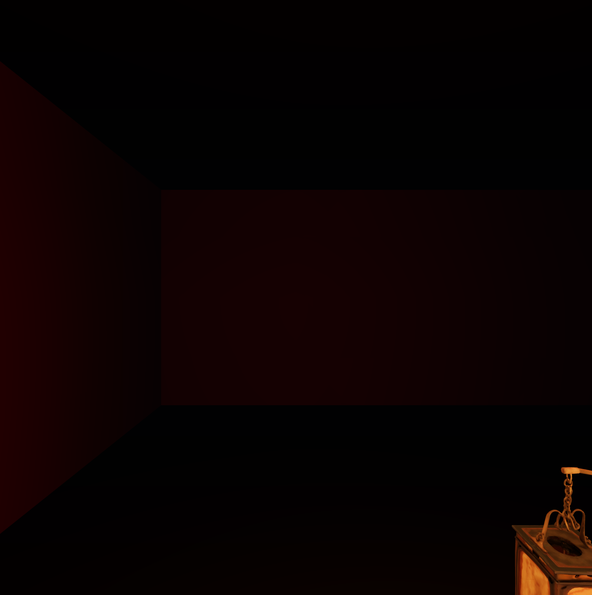

- **세로(Y축) banding:** 프로브 격자가 `gw × 3 × gh`로 **수직 방향이 3층뿐**이다. 셰이딩 점이 위/아래 프로브 사이를 트라이리니어 보간할 때 특정 높이에서 가중치가 급변해, 벽면에 가로 띠처럼 밝기가 바뀌는 구간이 생긴다.
- **프로브 보간 셀 가시성:** 보간 셀 하나가 월드에서 크다 보니(셀 ≈ 4단위) 가까이서 보면 프로브 단위의 둥근 falloff가 눈에 드러난다. 위 그림 정면 벽의 타원형 밝은 영역이 그 흔적이다.
- **개선 방향(미적용):** 수직 프로브 층수↑ 또는 보간 셀 축소로 완화 가능하나, gather 패스 비용과 아틀라스 메모리가 증가한다. 실시간성과 마감을 고려해 현재 해상도를 유지하고 한계로 명시했다.

---

## 5. 실행 및 배포

```bash
npm install
npm run dev      # 로컬 개발 (http://localhost:5180)
npm run build    # 정적 빌드 → dist/
npm run preview  # 빌드 결과 미리보기
```

- **배포:** GitHub Pages — https://jonghunpark09093.github.io/joseon-maze/ (main 푸시 시 GitHub Actions가 자동 빌드·배포)
- `vite.config.js`의 `base: './'` 로 상대 경로 빌드 → 임의의 정적 호스트/서브경로에서 동작.

---

## 6. 사용 에셋 및 출처

> 코드(미로 생성·DDGI·게임플레이·오디오)와 본 리포트의 모든 스크린샷은 직접 제작했다. 외부 에셋은 아래뿐이며 라이선스를 준수한다.

| 에셋 | 출처 / 제작 | 라이선스 |
|---|---|---|
| 추격자(귀신) 모델·애니메이션 | Meshy AI 생성 | 생성물 |
| 등불(등롱) 모델 | Meshy AI 생성 | 생성물 |
| 호랑이 모델·애니메이션 | "Running Tiger" by Amil (francescolima74) — https://skfb.ly/6SuVt | **CC BY 4.0** (출처표시) |
| 바닥 텍스처 (Forest Ground 01) | [Poly Haven](https://polyhaven.com/a/forrest_ground_01) | CC0 |
| 벽 텍스처 (Wood Cabinet Worn Long) | [Poly Haven](https://polyhaven.com/a/wood_cabinet_worn_long) | CC0 |
| 밤하늘 HDRI (Satara Night) | [Poly Haven](https://polyhaven.com/a/satara_night_no_lamps) | CC0 |
| 귀신 음성(울음·웃음) | 자체 Web Audio 절차합성 (`src/audio.js`) | 자작 (외부 샘플 0) |

- CC0는 출처표시 의무가 없으나 학술적 정직성을 위해 명기한다.
- 호랑이는 **CC BY 4.0** 이므로 위 출처표시가 라이선스 요건이다.
